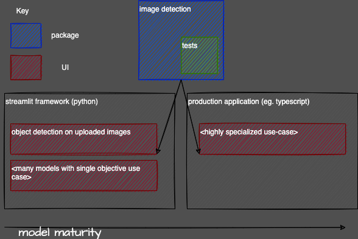

# Streamlit Object Detection

Example object detection application using [Streamlit](https://docs.streamlit.io/) for UI. You can download model weights [here](https://github.com/patrick013/Object-Detection---Yolov3). Application pages use python subpackages eg. `image_detection/` to decouple user interface from computer vision model logic.



**Figure X.X Example use case of where this app might fit into a product development pipeline.**

## Develop

[pyenv](https://github.com/pyenv/pyenv) is a great tool for python management and [poetry](https://python-poetry.org/) for managing python packages 😃

```bash
# Run app in poetry venv
./scripts/run-dev.sh

# Test
pytest
```
